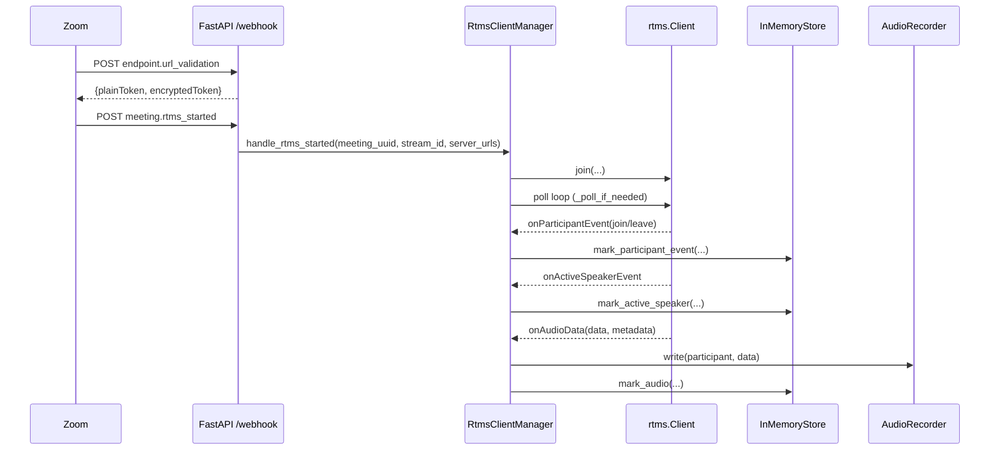
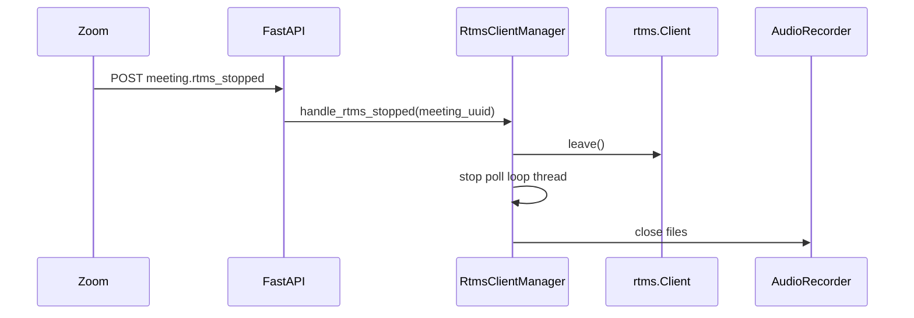

# Zoom RTMS + Webhook Local Prototype Plan

## 1) Feasibility check

### Technical restatement
Build a **local FastAPI backend** that accepts Zoom webhooks, validates requests, reacts to RTMS stream lifecycle events, connects an RTMS client, processes participant/session/audio callbacks, writes local audio files, and exposes logs/state endpoints for observability.

### What is strongly supported (official Zoom sources)
- RTMS SDK for Python is supported on Python 3.10+ and Linux x64 / macOS arm64.  
- RTMS webhook-driven start flow using `meeting.rtms_started` with `meeting_uuid`, `rtms_stream_id`, `server_urls`.  
- Session/participant/audio/active-speaker callback APIs in the RTMS SDK (`onParticipantEvent`, `onAudioData`, `onActiveSpeakerEvent`).  
- Zoom webhook endpoint validation (`endpoint.url_validation`) and HMAC signature validation pattern (`x-zm-signature`, `x-zm-request-timestamp`).

### Uncertain / constrained parts
- **“Who is currently talking”**: directly available via active speaker callback when emitted (`onActiveSpeakerEvent`). If unavailable in a given audio mode/payload, only heuristic inference is possible.  
- **“Separate audio per participant”**: depends on RTMS audio mode and metadata. In `AUDIO_MIXED_STREAM`, speaker identity is not embedded per audio callback for current speaker; use active-speaker events for correlation. In multi-stream/per-speaker scenarios metadata can map audio to users.

### Explicit support status for requested capabilities
1. Participant joins/leaves: **Directly supported** via participant callbacks and webhook/session events.  
2. Active speaker: **Partially direct** (active-speaker callback). **Fallback inference** only if callback/metadata gaps occur.  
3. Receive audio: **Directly supported** via RTMS audio callback.  
4. Separate audio per participant: **Partially direct**, depends on stream mode/metadata availability.  
5. Persist local audio files: **Supported** in app logic (write callback PCM to WAV files).

### Assumptions
- You have a Zoom app/account with RTMS access enabled.
- Zoom sends webhook events to local endpoint (via tunnel for localhost).
- RTMS Python package API in current release remains consistent with examples.
- Prototype writes WAV headers using configured sample rate/channels.

### Risks and limitations
- RTMS entitlement/setup in Zoom Marketplace is the most common blocker.
- If Zoom delivers mixed stream without user attribution, strict per-user isolation is impossible.
- Local network/tunnel instability may drop webhook delivery.
- Prototype uses in-memory state (non-durable).

### Success criteria
- Webhook endpoint validates challenge and verifies signature.
- `meeting.rtms_started` starts RTMS client session.
- Join/leave/active-speaker callbacks update `/state`.
- Audio files appear in `recordings/<meeting_uuid>/`.
- Logs show deterministic end-to-end lifecycle.

---

## 2) Technical design

### High-level architecture
- **FastAPI HTTP API**: `/webhook`, `/health`, `/state`
- **Webhook security module**: endpoint validation + HMAC signature verification
- **RTMS session manager**: one RTMS client per meeting stream, callback wiring, polling loop thread
- **In-memory meeting store**: meeting + participant lifecycle + active speaker + last audio timestamp
- **Audio recorder**: participant-keyed WAV sinks under local filesystem
- **Structured logging**: JSON logs for local observability

### Main components and responsibilities
- `app.py`: route handling and orchestration.
- `webhook_security.py`: Zoom-compatible HMAC functions.
- `rtms_client_manager.py`: start/stop RTMS sessions, callback registration.
- `store.py`: thread-safe in-memory state snapshot.
- `audio_writer.py`: WAV sink management.

### Data flow
1. Zoom sends webhook to `/webhook`.
2. App handles challenge OR validates signature.
3. On `meeting.rtms_started`, extract stream params and start RTMS client.
4. Poll loop dispatches SDK callbacks.
5. Participant + active speaker update in-memory state.
6. Audio callback writes participant/mixed WAV file.
7. User inspects `/state` and logs.

### Sequence diagram — startup and media flow

### Sequence diagram — stop flow

### Local development workflow
- Run FastAPI via `uvicorn`.
- Expose localhost via ngrok/cloudflared for webhook callback.
- Trigger real meeting with RTMS enabled.
- Observe logs, `/state`, and files under `recordings/`.

### Error handling strategy
- Reject invalid signatures (`401`).
- Return `400` for malformed validation payload.
- Log but continue on non-fatal callback parse errors.
- Stop session cleanly on `meeting.rtms_stopped`.

### Security considerations (local)
- Store secrets only in `.env`, never hardcode.
- Validate webhook signature for non-challenge events.
- Keep endpoint private/randomized tunnel URL when testing.
- No credentials in logs.

### File/folder structure
- `src/zoom_rtms_local/` application modules.
- `docs/PROTOTYPE_PLAN.md` design + runbook.
- `.env.example` configuration template.
- `recordings/` generated output audio.

### State management approach
- Thread-safe in-memory store keyed by `meeting_uuid`.
- Participant state tracks joined/left/presence and last audio timestamp.
- Active speaker tracked at meeting scope.

### Participant identity ↔ audio mapping strategy
- Primary key: callback metadata `userId`/`userName`.
- Fallback key: `mixed` when metadata absent.
- Active speaker timeline from dedicated callback.

### Audio format choice
- WAV (PCM) for immediate local playback/tooling compatibility.
- Assumes RTMS callback PCM settings match configured sample rate/channels.

### Logging and debugging
- JSON logs with contextual fields: `meeting_uuid`, `participant_id`, `event`, `stream_id`, `path`.
- `/state` endpoint provides runtime inspectability.

### Test strategy
- Unit-level: signature computation and payload extraction.
- Integration-lite: POST synthetic webhook JSON to local FastAPI.
- Runtime verification: real Zoom meeting + generated WAV files.

### Future production hardening
- Durable state store (Redis/Postgres).
- Worker supervision and reconnect policies.
- Metrics/tracing (Prometheus/OpenTelemetry).
- Strict replay protection and timestamp skew checks.
- Object storage for recordings and lifecycle management.

---

## 3) Task breakdown (dependency ordered)

1. **Project bootstrap**  
   - Purpose: establish runtime and package metadata  
   - Inputs: Python 3.11+, dependency list  
   - Outputs: `pyproject.toml`, package scaffold  
   - Dependencies: none  
   - Done: app imports and starts.

2. **Configuration + logging**  
   - Purpose: consistent env and observability  
   - Inputs: `.env` values  
   - Outputs: settings loader, JSON logger  
   - Dependencies: task 1  
   - Done: logs are structured and env-driven.

3. **State store**  
   - Purpose: meeting/participant lifecycle tracking  
   - Inputs: webhook + RTMS callbacks  
   - Outputs: thread-safe snapshot model  
   - Dependencies: task 2  
   - Done: `/state` reflects events.

4. **Webhook security + receiver**  
   - Purpose: Zoom endpoint validation + signature verification  
   - Inputs: webhook HTTP request  
   - Outputs: accepted/rejected event dispatch  
   - Dependencies: task 2  
   - Done: challenge and signed webhook path works.

5. **RTMS session manager**  
   - Purpose: start/stop client and process callbacks  
   - Inputs: `meeting.rtms_started/stopped` payloads  
   - Outputs: active RTMS client runtime  
   - Dependencies: tasks 2–4  
   - Done: callbacks fire and are logged.

6. **Audio recording pipeline**  
   - Purpose: persist callback audio locally  
   - Inputs: audio frames + metadata  
   - Outputs: WAV files under `recordings/`  
   - Dependencies: task 5  
   - Done: files created with per-participant or mixed fallback naming.

7. **Developer docs/runbook**  
   - Purpose: setup/run/verify/config guidance  
   - Inputs: implemented flow  
   - Outputs: actionable docs and checklist  
   - Dependencies: all prior tasks  
   - Done: local user can run and verify.

---

## 4) Implementation plan

1. Initialize Python package with FastAPI + RTMS deps.
2. Add `Settings` via `pydantic-settings` and `.env.example`.
3. Add JSON logging setup.
4. Implement thread-safe in-memory meeting/participant store.
5. Implement Zoom webhook security helpers (challenge + signatures).
6. Build `/webhook` endpoint for challenge and signed event routing.
7. Create RTMS manager with callback registrations:
   - join/leave
   - participant lifecycle
   - active speaker
   - audio callback
8. Add background polling loop per session (`client._poll_if_needed()`).
9. Add WAV recording sink keyed by participant (or `mixed`).
10. Add `/health` and `/state` for local observability.
11. Validate with local static checks and app startup.

